<div align="center">

```text
 ██████╗██╗   ██╗██████╗ ███████╗██████╗     ██████╗ ██╗      █████╗  ██████╗██╗  ██╗
██╔════╝╚██╗ ██╔╝██╔══██╗██╔════╝██╔══██╗    ██╔══██╗██║     ██╔══██╗██╔════╝██║ ██╔╝
██║      ╚████╔╝ ██████╔╝█████╗  ██████╔╝    ██████╔╝██║     ███████║██║     █████╔╝ 
██║       ╚██╔╝  ██╔══██╗██╔══╝  ██╔══██╗    ██╔══██╗██║     ██╔══██║██║     ██╔═██╗ 
╚██████╗   ██║   ██████╔╝███████╗██║  ██║    ██████╔╝███████╗██║  ██║╚██████╗██║  ██╗
 ╚═════╝   ╚═╝   ╚═════╝ ╚══════╝╚═╝  ╚═╝    ╚═════╝ ╚══════╝╚═╝  ╚═╝ ╚═════╝╚═╝  ╚═╝
                                                CYBERBLACK-OPS v2.3.0 Enterprise Edition
```

# CYBERBLACK-OPS v2.3.0

### *Enterprise Security Operations Console & StegoForge Covert Steganography Engine*

[](https://python.org)
[]()
[]()
[]()
[](LICENSE)

*Engineered for Enterprise SOC Analysts, Red Teams, Penetration Testers, Incident Responders, and Digital Forensics Specialists.*

---

</div>

## ⚡ Quickstart

### 1. System Requirements & Prerequisites
- **Python**: 3.11 or higher
- **Operating System**: Linux, macOS, or Windows 10/11 (PowerShell / Windows Terminal recommended)
- **Terminal Emulator**: ANSI 24-bit Truecolor compatible (e.g., Windows Terminal, Alacritty, iTerm2, Kitty, GNOME Terminal)

### 2. Repository Deployment
```bash
# Clone the repository
git clone https://github.com/ANONYMOUSworld112/CYBERBLACK-OPS.git
cd CYBERBLACK-OPS

# Create isolated Python virtual environment
python -m venv .venv

# Activate Virtual Environment
# Linux / macOS:
source .venv/bin/activate

# Windows (PowerShell):
.venv\Scripts\Activate.ps1
```

### 3. Package Installation
```bash
# Install CyberBlack-OPS and StegoForge engine in editable mode
pip install -e .
```

### 4. Interactive & CLI Workstation Launch
```bash
# 1. Launch Main CyberBlack-OPS Interactive Workstation Console
cyberblack

# 2. Launch Built-in StegoForge Steganography Wizard Directly
cyberblack stego


```

---

## 🖥️ Platform Visual Interface & Terminal HUD Gallery

Explore the dedicated terminal interface screens and high-resolution modules built into CYBERBLACK-OPS:

### 1. Command Center & Operational Domain Orchestration
Central command hub categorizing **40 industry-standard security tools** across **11 operational domains**, featuring live system resource telemetry, IP auto-resolution, legal execution gates, and express shortcut routing.

<div align="center">
  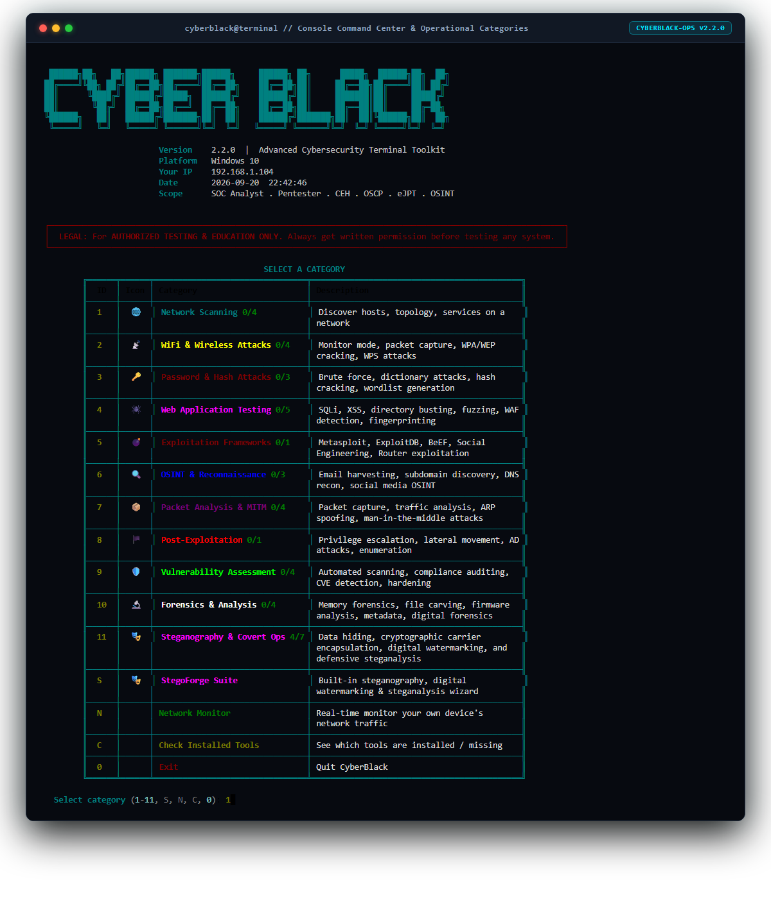
</div>

---

### 2. Domain Browser // Network Scanning & Reconnaissance
Structured operational index displaying binary presence (`INSTALLED` / `NOT INSTALLED`), risk ratings (LOW, MEDIUM, HIGH, CRITICAL), and target syntax descriptors.

<div align="center">
  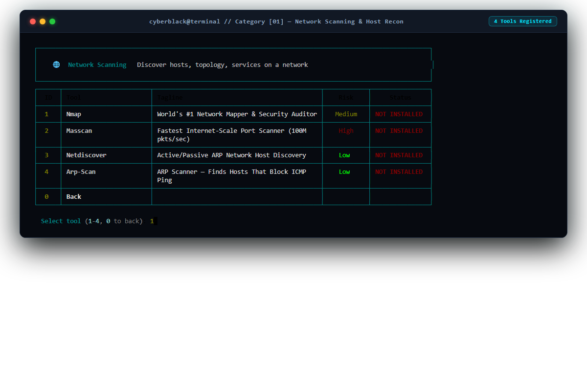
</div>

---

### 3. Tool Inspection & Security Execution Gate (`nmap`)
Deep-dive tool view providing syntax references, key operational flags, real-world execution examples, expert security tips, and interactive confirmation gates prior to binary launch.

<div align="center">
  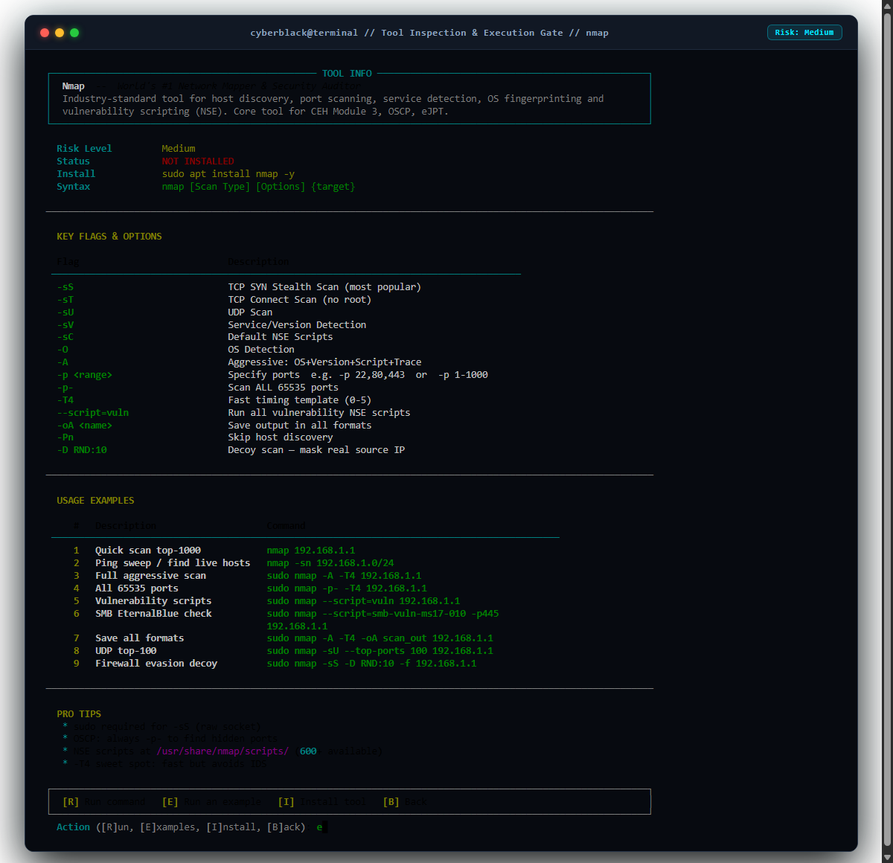
</div>

---

### 4. Real-Time Network Interface & Socket Monitor
Live HUD telemetry displaying physical and virtual network adapters, IPv4/MAC details, real-time packet throughput (Recv/Sent rates), adapter states (`UP`/`DOWN`), active TCP/UDP sockets, and host CPU/Memory metrics.

<div align="center">
  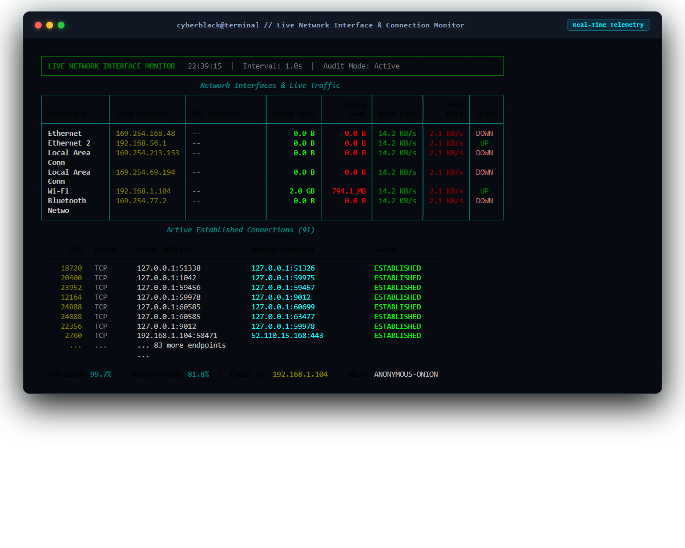
</div>

---

### 5. Local Binary Registry & Installation Matrix
Enterprise inventory auditing local presence of all 40 registered security binaries, displaying binary file paths, status badges, and native package manager installation scripts.

<div align="center">
  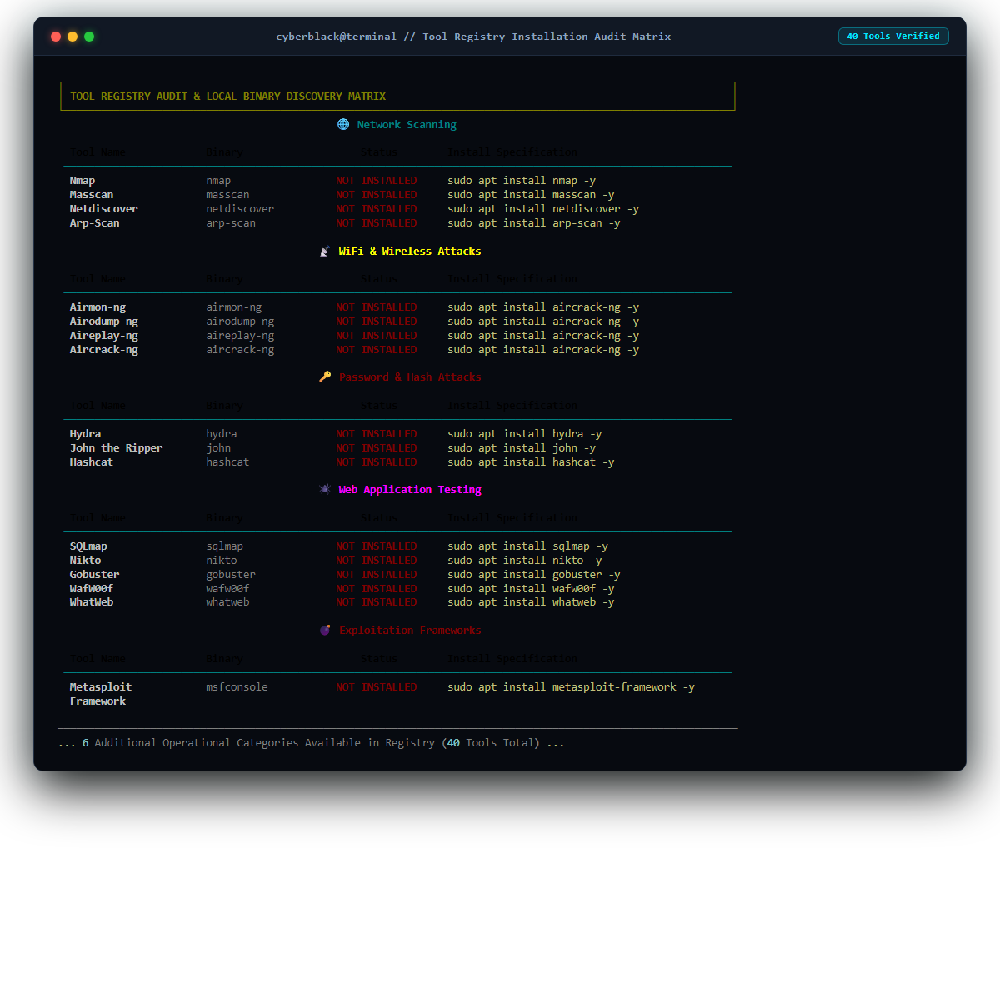
</div>

---

### 6. StegoForge Steganography Engine & Interactive Wizard
Interactive steganographic workspace providing end-to-end payload embedding, extraction, capacity estimation, forensic steganalysis, digital watermarking, and laboratory research.

<div align="center">
  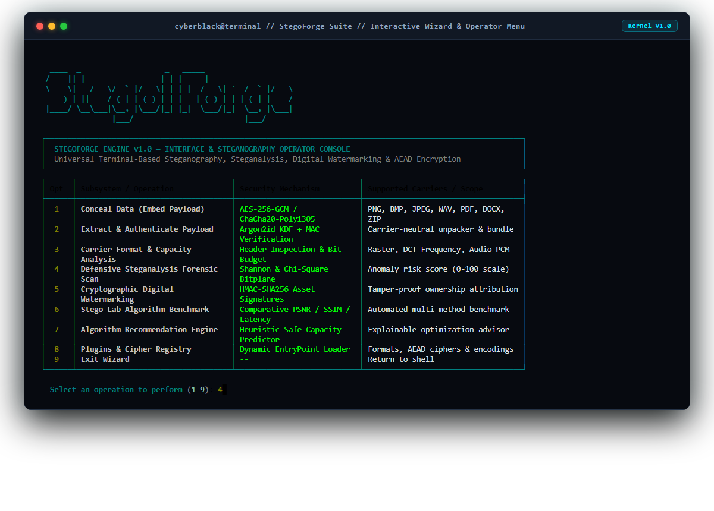
</div>

---

### 7. Defensive Statistical Steganalysis Forensic Audit
Forensic anomaly detection engine calculating global Shannon entropy, sliding block entropy variance, Chi-Square Pair-of-Values (PoV) distribution, trailing EOF byte carving, and composite risk scoring (0–100 scale).

<div align="center">
  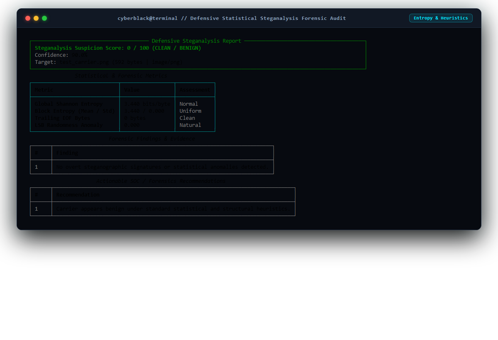
</div>

---

### 8. Stego Lab Comparative Algorithm Benchmark Matrix
Automated laboratory benchmarking carrier media across compatible algorithms, reporting maximum capacity, embed/extract execution latency (ms), PSNR (dB), SSIM structural fidelity, and round-trip SHA-256 payload verification.

<div align="center">
  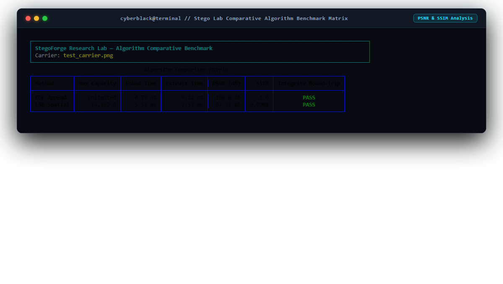
</div>

---

### 9. Cryptographic Digital Watermarking & HMAC-SHA256 Verification
Tamper-evident asset authentication embedding cryptographic owner signatures and licensing metadata into carrier assets with zero-tampering verification.

<div align="center">
  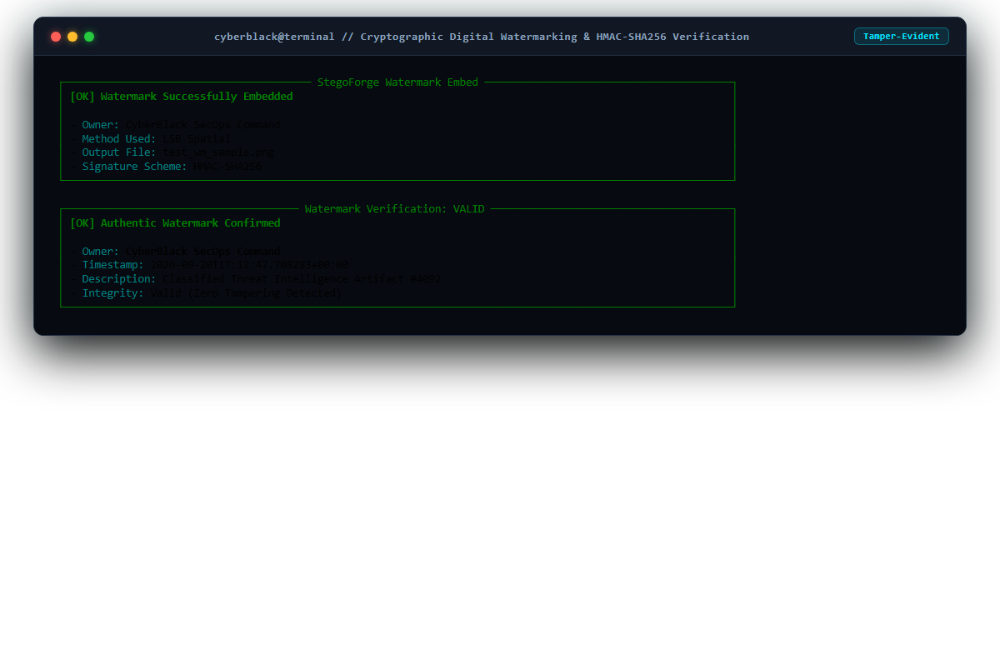
</div>

---

### 10. Carrier Format Drivers & Authenticated Cipher Plugins
Extensible plugin matrix displaying active format handlers (PNG, BMP, JPEG, WAV, PDF, DOCX, ZIP) and authenticated cryptographic ciphers (AES-256-GCM, ChaCha20-Poly1305, Argon2id KDF).

<div align="center">
  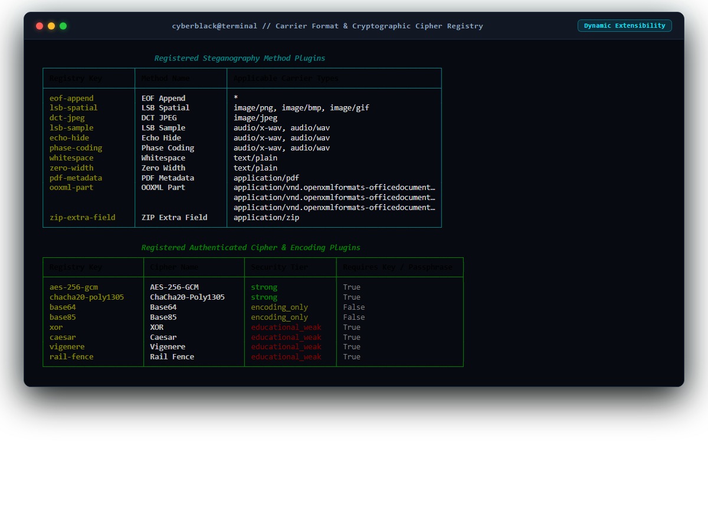
</div>

---

## 🏛️ Executive Summary & Platform Architecture

**CYBERBLACK-OPS** combines modular security workstation management with an advanced covert steganography framework built to enterprise security standards.

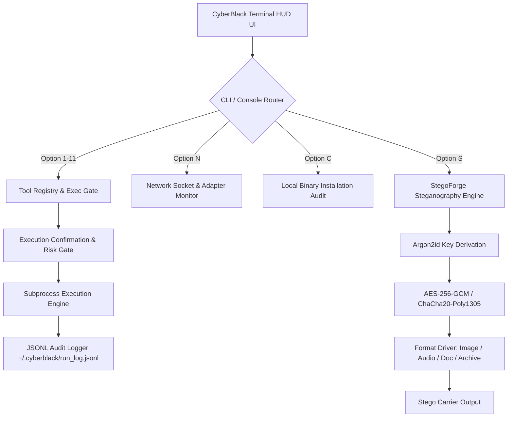

### Core Architecture Pillars:
1. **CyberBlack Console (`cyberblack`)**: An interactive command center orchestrating 40 industry-standard tools across 11 security domains, featuring auto-discovery, risk profiling, execution safety gates, JSONL audit logging, and live adapter socket monitoring.
2. **StegoForge Engine (`stegoforge`)**: A high-performance steganography, digital watermarking, and defensive steganalysis platform adhering to Kerckhoffs's principle.

> [!IMPORTANT]
> **LEGAL NOTICE & ETHICAL USE POLICY**  
> CYBERBLACK-OPS is designed strictly for authorized penetration testing, red team engagements, incident response, digital forensics research, and academic security education. Always secure explicit written authorization prior to evaluating target infrastructure.

---

## 🛠️ Security Tool Ecosystem & Operational Categories

CYBERBLACK-OPS organizes 40 curated tools into 11 specialized security domains:

| # | Operational Domain | Domain Description | Integrated Security Tools |
|---|--------------------|--------------------|---------------------------|
| **1** | **Network Scanning** | Host discovery, port enumeration, and Layer 2/3 reconnaissance | `nmap`, `masscan`, `netdiscover`, `arp-scan` |
| **2** | **WiFi & Wireless Attacks** | 802.11 monitor injection, handshake capture, and deauthentication | `airmon-ng`, `airodump-ng`, `aireplay-ng`, `aircrack-ng` |
| **3** | **Password & Hash Attacks** | Offline hash cracking, online brute-force, and dictionary attacks | `hydra`, `john`, `hashcat` |
| **4** | **Web Application Testing** | Content fuzzing, web vulnerability scanning, fingerprinting, and SQLi | `sqlmap`, `nikto`, `gobuster`, `wafw00f`, `whatweb` |
| **5** | **Exploitation Frameworks** | Penetration testing and automated exploit delivery platforms | `msfconsole` (Metasploit) |
| **6** | **OSINT & Reconnaissance** | Passive enumeration, subdomain discovery, and identity mapping | `amass`, `subfinder`, `sherlock` |
| **7** | **Packet Analysis & MITM** | Deep packet inspection, traffic interception, and poisoning | `wireshark`, `tcpdump`, `ettercap`, `bettercap` |
| **8** | **Post-Exploitation** | Privilege escalation, credential dumping, and lateral movement | `impacket` |
| **9** | **Vulnerability Assessment** | System hardening inspection, network vulnerability scanning | `openvas`, `lynis`, `nuclei`, `nmap-vuln` |
| **10** | **Forensics & Analysis** | Binary extraction, metadata analysis, and memory forensics | `binwalk`, `foremost`, `exiftool`, `autopsy` |
| **11** | **Steganography & Covert Ops** | Steganography, digital watermarking, and defensive steganalysis | `stegoforge`, `steganalysis`, `watermark`, `stego-lab`, `steghide`, `openstego`, `zsteg` |

---

## 🎭 StegoForge Engine Technical Capabilities

StegoForge delivers covert steganographic communications and defensive forensics:

### Multi-Format Carrier Support:
- **Raster Images**: PNG, BMP, GIF (LSB spatial domain) and JPEG (DCT frequency domain).
- **Audio Carriers**: Uncompressed WAV PCM (LSB sample modification, echo hiding, phase coding).
- **Document Packages**: PDF (metadata object stream injection), Word `.docx` (OOXML package parts).
- **Archive Media**: ZIP Extra Field injection, EOF append with carrier-neutral unpacking.

### Cryptographic Security & Authenticated Ciphers:
- **KDF**: Argon2id Key Derivation Function (64MB memory cost, GPU/ASIC brute-force resilient).
- **AEAD Ciphers**: AES-256-GCM and ChaCha20-Poly1305 with 128-bit authentication tags.

### Multi-Payload Container (`SFB1` Format):
- Multi-file steganographic payload bundling.
- Automatic path-traversal sanitization (`_sanitize_bundle_item_name`).
- Individual file integrity verification using SHA-256 checksums.

### Defensive Forensic Steganalysis:
- Global Shannon entropy & sliding block entropy variance analysis.
- Chi-Square Pair-of-Values (PoV) statistical distribution testing.
- Trailing EOF byte carving and signature scanning.
- Anomaly risk scoring on a 0–100 forensic scale.

---

## 💻 Command Line Interface & Usage Patterns

### Interactive Console (`cyberblack`)
```bash
# Launch workstation interface
cyberblack

# Console Menu Routing:
# [1-11] Select Security Domain
# [N]    Live Network Interface & Socket Monitor
# [C]    Audit Local Installation of all 40 Tools
# [S]    Launch StegoForge Interactive Wizard
# [0]    Exit Workstation
```

### StegoForge Automation Suite (`cyberblack stego`)
```bash
# Set environment flag for automated execution
export STEGOFORGE_ACK=1

# 1. Enumerate Registered Format & Cipher Plugins
cyberblack stego --yes plugins list

# 2. Carrier Capacity Pre-flight Assessment
cyberblack stego --yes recommend -c carrier.png -s 1024

# 3. Encrypt & Embed Payload (AES-256-GCM + Argon2id)
cyberblack stego --yes embed -i carrier.png -m lsb-spatial -c aes-256-gcm --payload-file sensitive.pdf -o stego.png

# 4. Extract & Verify Hidden Payload
cyberblack stego --yes extract -i stego.png -o output_dir/

# 5. Run Forensic Steganalysis on Carrier
cyberblack stego --yes steganalysis -i suspect.jpg

# 6. Apply Cryptographic HMAC Watermark
cyberblack stego --yes watermark embed -i asset.pdf -o signed.pdf --owner-id "SecurityTeam" --key "MasterKey"

# 7. Execute Stego Lab Benchmark Matrix
cyberblack stego --yes lab -c carrier.png
```

---

## 🛡️ Enterprise Security Governance

- **Zero-Implicit Execution**: Interactive confirmation gates ensure no binary is executed without explicit operator consent.
- **Path Traversal Shield**: StegoForge bundle extractors strip drive letters, absolute paths, and `../` traversal tokens to protect target hosts.
- **Auditing & Traceability**: Immutable JSONL execution logging stores execution metrics, operator inputs, and timestamps in `~/.cyberblack/run_log.jsonl`.
- **Memory Security**: Cryptographic keys are held in memory-hard Argon2id buffers and wiped post-execution.

---

## 📄 License & Attribution

Distributed under the **MIT License**. See [`LICENSE`](LICENSE) for complete terms.

<div align="center">

**CYBERBLACK-OPS v2.2.0** — *Next-Gen Security Operations & Steganography Engine*  
*Developed for Cyber Defense & Digital Forensics Engineering.*

</div>
